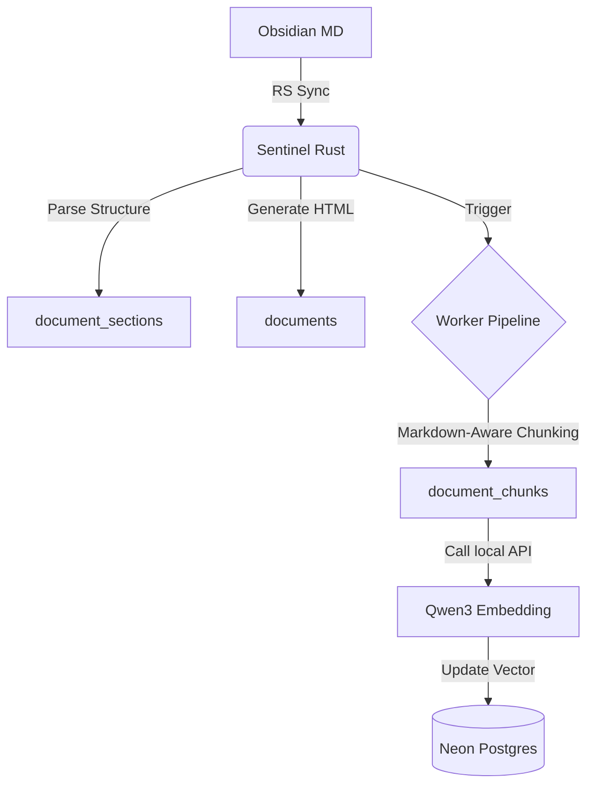
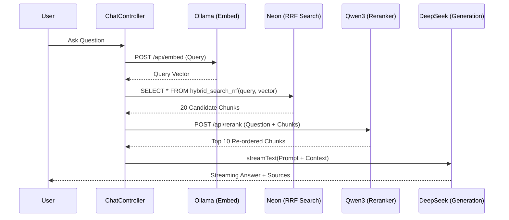

# RAG Implementation Plan: High-Fidelity Knowledge Synthesis

> [!NOTE]  
> This document outlines the industrial-grade RAG (Retrieval-Augmented Generation) strategy for Sparkle Codes, leveraging Obsidian as the source of truth and Neon Postgres as the semantic kernel.

## 1. System Philosophy
The RAG system is designed as a **Content-First Knowledge Pipeline**. It separates content ingestion from real-time generation to ensure low-latency performance, deterministic search results, and verifiable citations.

- **Offline Indexing**: All embedding and chunking happen during the sync phase.
- **Hybrid Retrieval**: Combining Postgres FTS and semantics (Vector) for technical accuracy.
- **LLM as Synthesizer**: The LLM is restricted to synthesizing retrieved context rather than "hallucinating" facts.

---

## 2. Technical Stack
- **Source**: Obsidian Vault (.md)
- **Ingestion Pipeline**: Sentinel (Rust) + Node.js Worker
- **Embedding Model**: `Qwen3-Embedding-4B` (GGUF via local Ollama/llama.cpp)
    - **Dimensions**: 2560
    - **Inference**: `f16_q8_0` GGUF
    - **Storage Type**: `halfvec(2560)`
- **Reranker**: `Qwen3-Reranker-4B`
    - **Selection Logic**: Inherits the strong multilingual and code-retrieval capabilities of the Qwen3 series. Optimized for mixed Chinese/English technical content and code snippets.
- **Storage**: Neon Postgres + `pgvector`
- **Retrieval**: Hybrid Search (Postgres FTS + Vector) + Rerank
- **Generation**: Vercel AI SDK + **deepseek-chat** (Replaces deprecated Gemini 1.5 Flash)

---

## 3. Data Architecture (Schema alignment)

### 3.1 Document Layer (`documents`)
Stores the full source document and its high-level metadata.
- `slug`, `vaultPath`: Unique identity.
- `contentHash`: Ensures incremental updates.
- `isPublished`: Controls visibility.

### 3.2 Structural Layer (`document_sections` & `document_blocks`)
Decomposes documents into units based on Markdown structure.
- **Sections**: Created by H1-H6 headers.
- **Blocks**: Captured via `^anchor-id`.

### 3.3 Semantic Layer (`document_chunks`)
The primary unit for RAG retrieval.
- **Size**: 400-800 tokens with 10% overlap.
- **Context Preservation**: Every chunk must carry its `section_path` (e.g., `Architecture > RAG > Ingestion`).
- **Embedding**: Stored in `halfvec(2560)` with `HNSW` index.
- **Extended Fields** (To be added):
    - `headingId`: TEXT (For precise citation anchor mapping).
    - `searchVector`: TSVECTOR (Pre-calculated weighted full-text index).
    - `tokenCount`: INTEGER (For context window management).
    - `hasCode`: BOOLEAN (Flag for technical content prioritization).

### 3.4 Searchable Index (Postgres FTS)
To optimize keyword performance, `document_chunks` will include a generated `tsvector` column:
- **Field Weighting**: 
    - Title Path / Heading Path (`A`)
    - Content (`B`)
- **Generation Strategy**: 
    ```sql
    SET searchVector = 
        setweight(to_tsvector('simple', coalesce(headingPath, '')), 'A') || 
        setweight(to_tsvector('simple', coalesce(chunkText, '')), 'B');
    ```
- **Configuration**: Use `simple` dictionary to protect technical terms from stemming.
- **Index**: 
    ```sql
    CREATE INDEX idx_chunks_search_vector ON document_chunks USING GIN (searchVector);
    ```

---

## 4. Ingestion Workflow


### 4.1 Ingestion Priorities
1. **Structural Metadata**: Keep the heading hierarchy and block IDs.
2. **Code Blocks**: Code fragments are preserved as whole chunks or logically partitioned by comments.
3. **Atomic Updates**: Only re-embed changed documents (tracked via hash).

---

## 5. Retrieval Orchestration

### 5.1 Hybrid Search Protocol (FTS + Vector + RRF)
The retrieval layer implements **Reciprocal Rank Fusion (RRF)** to combine semantic similarity with keyword exactness:
1. **Vector Search (Semantic)**: Top-N candidates via HNSW (Cosine Distance).
2. **Postgres FTS (Keyword)**: Top-N candidates via GIN (BM25-style `ts_rank`).
3. **Score Fusion**: `1.0 / (k + rank_v) + 1.0 / (k + rank_f)`.
4. **Variety Guard**: Deduplicate by `document_id` (limiting to Top-3 chunks per doc).

### 5.2 Retrieval Query Design: `hybrid_search_rrf` (Optimized)
```sql
CREATE OR REPLACE FUNCTION public.hybrid_search_rrf(
    p_query_text TEXT,
    p_query_embedding HALFVEC(2560),
    p_match_count INTEGER DEFAULT 20,
    p_vector_limit INTEGER DEFAULT 50,
    p_fts_limit INTEGER DEFAULT 50,
    p_rrf_k INTEGER DEFAULT 60
)
RETURNS TABLE (
    chunk_id TEXT,
    document_id TEXT,
    chunk_index INTEGER,
    heading_path TEXT,
    heading_id TEXT,
    chunk_text TEXT,
    vector_rank INTEGER,
    fts_rank INTEGER,
    rrf_score DOUBLE PRECISION
)
LANGUAGE sql STABLE AS $$
WITH published_chunks AS (
    SELECT dc.* FROM public.document_chunks dc
    INNER JOIN public.documents d ON d.id = dc."documentId"
    WHERE d."isPublished" = TRUE
),
vector_hits AS (
    SELECT id, ROW_NUMBER() OVER (ORDER BY pc.embedding <=> p_query_embedding)::INTEGER AS vector_rank
    FROM published_chunks pc
    ORDER BY pc.embedding <=> p_query_embedding LIMIT p_vector_limit
),
fts_hits AS (
    SELECT id, ROW_NUMBER() OVER (ORDER BY ts_rank(pc."searchVector", websearch_to_tsquery('simple', p_query_text)) DESC)::INTEGER AS fts_rank
    FROM published_chunks pc
    WHERE pc."searchVector" @@ websearch_to_tsquery('simple', p_query_text)
    ORDER BY ts_rank(pc."searchVector", websearch_to_tsquery('simple', p_query_text)) DESC
    LIMIT p_fts_limit
),
rrf_fused AS (
    SELECT COALESCE(v.id, f.id) AS id, v.vector_rank, f.fts_rank,
    COALESCE(1.0 / (p_rrf_k + v.vector_rank), 0.0) + COALESCE(1.0 / (p_rrf_k + f.fts_rank), 0.0) AS rrf_score
    FROM vector_hits v FULL OUTER JOIN fts_hits f ON v.id = f.id
),
deduped AS (
    SELECT *, ROW_NUMBER() OVER (PARTITION BY j.document_id ORDER BY j.rrf_score DESC) AS doc_rank
    FROM (
        SELECT dc.id AS chunk_id, dc."documentId" AS document_id, dc."chunkIndex" AS chunk_index,
               dc."headingPath" AS heading_path, dc."headingId" AS heading_id, dc."chunkText" AS chunk_text,
               r.vector_rank, r.fts_rank, r.rrf_score
        FROM rrf_fused r INNER JOIN public.document_chunks dc ON dc.id = r.id
    ) j
)
SELECT chunk_id, document_id, chunk_index, heading_path, heading_id, chunk_text, vector_rank, fts_rank, rrf_score
FROM deduped WHERE doc_rank <= 3
ORDER BY rrf_score DESC LIMIT p_match_count;
$$;
```

### 5.3 Rerank Phase
The results from `hybrid_search_rrf` are passed to `Qwen3-Reranker-4B` for a final precision sweep, sorting the documents by their direct relevance to the user's specific query.

---

## 6. Generation & UX
- **Context Injection**: Top-10 chunks from Reranker are injected into the System Prompt.
- **Citation Protocol**: Every claim in the LLM response must link to a chunk.
    - Format: `[source_id]` mapping to `https://sparkle.codes/blog/[slug]#[heading_id]`.
- **Streaming**: Implemented via Vercel AI SDK (**DeepSeek**) for low perceived latency.

---

## 7. Implementation Milestones

### Phase 1: Infrastructure & Models
- [ ] Setup Ollama/llama.cpp serving **Qwen3-Embedding-4B** and **Qwen3-Reranker-4B**.
- [ ] Enable `vector` extension in Neon production.
- [ ] Configure DeepSeek API keys for generation.

### Phase 2: Ingestion Logic (The "Sentinel" Upgrade)
- [ ] Implement Markdown-aware chunking in Rust (preserving `section_path`, `headingId`).
- [ ] Implement `tsvector` generation logic with weighted fields (Heading > Content).
- [ ] Add `tokenCount` and `hasCode` detection during ingestion.

### Phase 3: Search Backend
- [ ] Deploy `hybrid_search_rrf` stored procedure to Neon.
- [ ] Create `packages/ai` retrieval controller with Rerank support.

### Phase 4: Frontend Integration
- [ ] Build `/api/chat` and `/api/ask` endpoints using DeepSeek.
- [ ] Implement citation-aware UI components in `apps/web`.

---

## 8. Sentinel Ingestion Pipeline (Deep Dive)

To ensure the vector representations are high-quality, the Sentinel Rust daemon will handle the transformation from Markdown to Vector.

### 8.1 Chunking Strategy: "Heading-Aware Atomic Splitter"
**Policy: Area-Based Filtering**
To optimize indexing costs and maintain retrieval relevance, ONLY documents residing in the `WORK` area (Public Blog) are processed for embedding. `LEARN` and `RESOURCES` areas remain searchable via standard metadata search but do not consume vector storage.

**Implementation: `text-splitter` (Rust)**
Sentinel utilizes the [text-splitter](https://crates.io/crates/text-splitter) crate with the `markdown` feature:
1. **Source**: Each `SectionNode` (content between headings) generated by `markdown-parser` is treated as a candidate chunk.
2. **Recursive Splitting**:
   ```rust
   use text_splitter::{ChunkConfig, MarkdownSplitter};
   
   // Configure splitter with target token count and overlap
   let splitter = MarkdownSplitter::new(
       ChunkConfig::new(800)
           .with_overlap(80)
           .with_sizer(tokenizer) // Using Tiktoken or comparable sizer
   );
   
   let chunks = splitter.chunks(section.text_content);
   ```
3. **Context Prepend**: Every chunk text is prefixed with its structural context before embedding:
   ```rust
   // Contextual enrichment for better retrieval accuracy
   let text_to_embed = format!(
       "Document: {}\nSection: {}\n\n{}",
       meta.title,
       section.heading_text,
       chunk_fragment
   );
   ```

### 8.2 Concurrent Embedding Engine
**Architecture: Controlled Parallelism**
To maximize throughput without overwhelming the local Ollama/llama.cpp instance, Sentinel uses a `JoinSet` coupled with a `Semaphore`:
- **Concurrency Control**: `tokio::sync::Semaphore` limits active embedding requests (e.g., 4 concurrent workers).
- **Batching**: Chunks are processed in batches of 16 to leverage GPU parallelism in Ollama.
- **Fail-Fast**: Any batch failure triggers a retry with exponential backoff before marking the document sync as failed.

### 8.3 Vector Persistence (Postgres halfvec)
**Pattern: Structured Binary Literal**
Sentinel sends embeddings to Neon using `sqlx` by formatting the `Vec<f32>` into a Postgres-compatible array literal and casting it to `halfvec`:
```sql
-- Pattern for sqlx insertion
let vector_literal = format!("[{}]", embedding.iter().map(|v| v.to_string()).collect::<Vec<_>>().join(","));

sqlx::query!(
    "INSERT INTO document_chunks (..., embedding) VALUES (..., $1::halfvec)",
    vector_literal
)
```

---

## 9. AI Orchestration Flow (Node/TS)

The runtime retrieval logic is decoupled from the frontend in `packages/ai`.

### 9.1 Multi-Stage Retrieval Controller


### 9.2 Citation Mapping
Every chunk returned from the database includes a `document_id` and `heading_id`. 
The frontend resolves these to canonical links: `https://sparkle.codes/blog/${slug}#${headingId}`.
