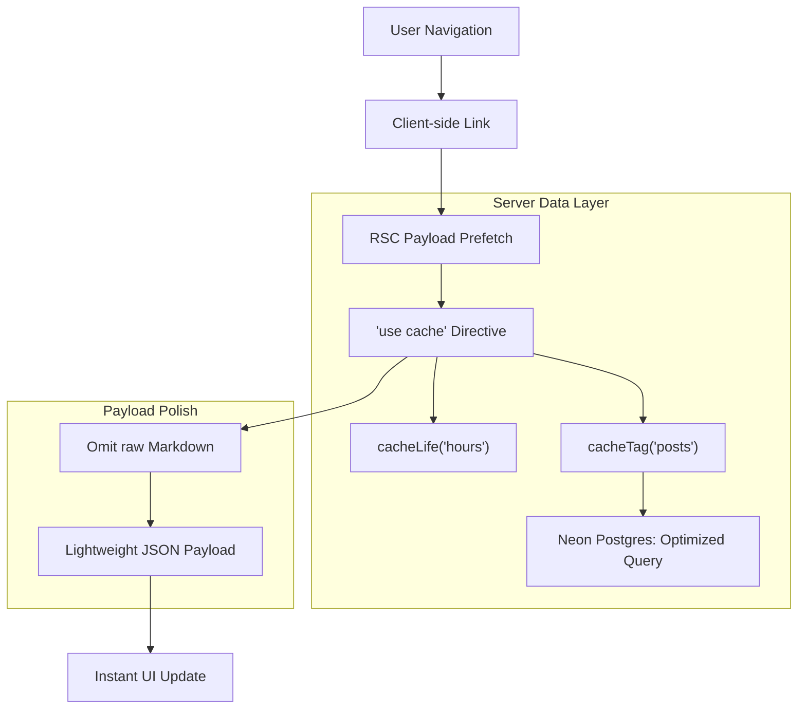

# Sparkle Codes: Modern Caching Architecture (Next.js 16+)

This document details the multi-layered caching strategy implemented to achieve sub-second, "instant" transitions between technical blog posts, leveraging the latest Next.js 16 **Cache Components** and **Dynamic Caching** APIs.

## Architecture Overview

The system utilizes a modern, declarative caching strategy that spans from the database query to the client-side RSC payload optimization.

---

## Tier 1: Optimized Database Access
**Location**: `packages/database/queries/posts.ts`

To minimize initial load from Neon Postgres, we avoid fetching large text blobs (`content`) during summary listings.

*   **Reading Time Calculation**: We use Postgres `char_length()` in the SQL query to calculate reading time server-side, avoiding the transfer of entire blog bodies for metadata lists.
*   **Column Selection**: Listing queries strictly select only the metadata needed for cards (slug, tags, date), preventing unnecessary I/O.

## Tier 2: 'use cache' & cacheLife (Next.js 16)
**Location**: `apps/web/lib/blog.ts`

The most computationally expensive part of the blog is the **Markdown Processing Pipeline** (KaTeX for math, Shiki for syntax highlighting). We now use the standard Next.js 15/16 caching directives instead of the legacy `unstable_cache`.

*   **Implementation**: Applied the `'use cache'` directive at the function level.
*   **Lifecycle Management**: Instead of hardcoded TTL constants, we use `cacheLife('hours')`. This allows Next.js to manage cache durability based on context-aware profiles. In development, it respects hot-reloads; in production, it satisfies high-traffic demands.
*   **Benefits**: 
    - Bypasses Markdown parsing (KaTeX/Shiki) on cache hits.
    - Eliminates the need for manual `React.cache()` deduplication as the directive handles it natively.

## Tier 3: Declarative Tagging & Revalidation
**Location**: `apps/web/lib/blog.ts`

Granular invalidation is handled via the new `cacheTag` API, replacing old key-based management.

*   **Implementation**: `cacheTag('posts', 'post-${slug}')`.
*   **Operation**: Allows specific posts or the entire collection (via the `posts` tag) to be invalidated on-demand when content is synchronized from Obsidian or edited in the UI.

## Tier 4: Payload & Transfer Optimization
**Location**: `apps/web/lib/blog.ts` (Mapper logic)

To speed up client-side transitions via `next/link`, we optimize the RSC JSON payload.

*   **Logic**: The `mapDocumentToPost` function explicitly **OMITS** the `content` (raw Markdown) and original `html` fields.
*   **Result**: The JSON payload only contains the final `body.html`. This reduces transfer size by ~60%, leading to faster parsing in the browser and near-instant transitions.

---

## Client-Side Strategy: Reading History
**Location**: `apps/web/components/ReadingHeader.tsx`

To provide the "Recently Viewed" feature without server roundtrips:
1.  **LocalStorage**: Maintains the last 10 visited `slugs`.
2.  **Intelligent Padding**: If history is < 5 entries, it "pads" the list using `suggestedPosts` from the server-side global summary cache (`getAllPostSummaries`).

## Summary of Key APIs

| Layer | API / Method | Responsibility |
| :--- | :--- | :--- |
| **Logic** | `'use cache'` | Top-level function caching directive (Next.js 16) |
| **Duration** | `cacheLife('hours')` | Defines context-aware cache durability policies |
| **Invalidation** | `cacheTag(...)` | Assigns semantic tags for on-demand revalidation |
| **Transfer** | `Omit<BlogPost, 'content'>` | Minimizes RSC payload size for sub-second transitions |

---

> [!IMPORTANT]
> This architecture favors **Consistency over Staleness**. If you update a blog post, triggers for `revalidateTag('posts')` must be called to propagate changes across the edge.
