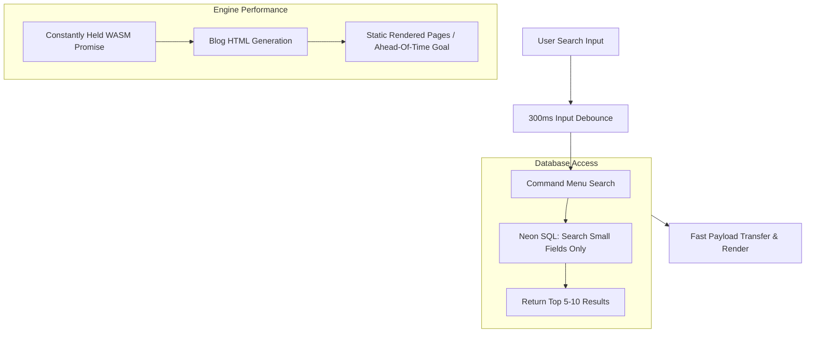

# Sparkle Codes: Modern Caching and Performance Architecture

This document outlines the multi-layered strategy implemented to achieve fast transitions between technical blog posts and highly responsive search functionality. It acknowledges the nuances of Next.js 16 caching behavior, the nature of heavy server-side engines, and SQL database performance boundaries.

## Architecture Overview

---

## 1. Local Search Optimization: DB-Level Filtering

For high-frequency edge interactions like the global Command Menu search, previous concepts like "Global Memory Resident Search" are structurally flawed due to:
- Frequent cache misses and cache-key parameter fragmentation.
- Divergent behavior between local environments and deployed distributed nodes.
- Discontinuous memory states caused by routine Serverless instance cycles.

**The Reliable Approach:**
1. **Narrow Scope SQL**: Real-time searching has been relocated back to the SQL logic layer. We strictly index and query only against **small fields** (`title`, `slug`, `description`) directly on Neon Postgres, fully ignoring the main multi-megabyte `content` payload.
2. **Result Pruning**: Database queries are capped aggressively to the top 5~8 records.
3. **UI Debouncing**: The `CommandMenu` implements a controlled `300ms` debounce that prevents overwhelming the network and database connections with rapid sequential keystrokes.

## 2. API "Pre-Warming" vs Next.js Reality

The `fetch('/api/search?query=warmup')` is implemented merely as a rudimentary "node alarm clock" upon client layout mount.

> [!WARNING]
> It is structurally inaccurate to declare this achieves "Zero-Latency API" response. `use cache` isolates cache entries to varying scopes and parameters. A dummy `query=warmup` does **not** prepare responses for subsequent genuine search strings. Furthermore, the Serverless application lifecycle (Lambda, Vercel Edge) makes any strict promises about node uptime highly speculative.

**Purpose:** This low-priority fetch ensures the container holding the API engine is somewhat "hot" (initialized) by the time a user might click the search box, eliminating the absolute worst of the "Server Setup" penalty cost, but it does **not** pre-cache their specific searches nor act as an infallible defense against cold starts.

## 3. WASM & Engine Optimization (Shiki)

Currently, the Markdown code highlighters (`shiki`) run off a C++ regular expression compiler (`vscode-oniguruma`) compiled via WebAssembly. Running it dynamically per request blocks the Node.js main thread severely.

1. **Current Pattern**: Module-level persistence. We declare a `highlighterPromise` singleton outside of the render hot-path. 
2. **The Ideal Goal (Ahead-of-Time Generation)**: Ultimately, the best practice is completely eliminating WASM processing at request-time. Code blocks and Markdown should ideally be compiled strictly during CI/CD Build-time, moving the heavy-lifting off the runtime nodes entirely.

## 4. Payload Compression over Wire

By moving search queries to strictly metadata tables rather than returning `html`, `content`, or raw markdown bodies to the front end, we significantly reduce the JSON package being transferred from the edge proxy to the client application.

**Connection Context (Neon HTTP vs WebSockets)**
Previously, returning unpruned payload blobs triggered performance constraints with Neon's HTTP API limits. However, the root cause was returning massive unneeded arrays over a hot search path. While WebSockets may remain open for session continuity, swapping drivers would not excuse or solve the cost of shuttling mega-bytes of text for a simple autocomplete box. The structural fix implemented is to strictly enforce payload sizing at the Postgres level.
