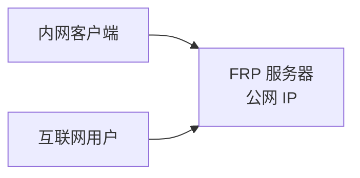

# 端口转发配置

## 什么是端口转发

端口转发（Port Forwarding）是一种网络技术，允许将外部网络的请求转发到内部网络的特定设备和端口。常用于：

- 🏠 **家庭服务器**：将本地服务暴露到公网
- 🌐 **开发调试**：远程访问本地开发环境
- 🔧 **服务部署**：通过公网访问内网服务

---

## 一、路由器端口映射（NAT 转发）

### 配置步骤

1. **登录路由器管理界面**
   ```
   常见地址：192.168.1.1 或 192.168.0.1
   ```

2. **找到端口转发/虚拟服务器设置**
   - 通常在"高级设置"或"NAT 设置"中

3. **添加转发规则**

| 字段 | 说明 | 示例 |
|------|------|------|
| 内部 IP | 内网设备 IP | 192.168.1.100 |
| 内部端口 | 服务监听端口 | 80 |
| 外部端口 | 路由器暴露端口 | 8080 |
| 协议 | TCP/UDP/Both | TCP |
| 状态 | 启用/禁用 | Enabled |

### 常见服务端口参考

| 服务类型 | 端口 | 协议 |
|----------|------|------|
| HTTP | 80 | TCP |
| HTTPS | 443 | TCP |
| SSH | 22 | TCP |
| FTP | 21 | TCP |
| Minecraft 游戏 | 25565 | TCP |

---

## 二、FRP 内网穿透

### 架构说明



### 服务端配置（frps.ini）

```ini
[common]
bind_port = 7000
token = your_secret_token
vhost_http_port = 80
vhost_https_port = 443
```

### 客户端配置（frpc.ini）

```ini
[common]
server_addr = <frp 服务器公网 IP>
server_port = 7000
token = your_secret_token

# TCP 转发
[ssh]
type = tcp
local_ip = 127.0.0.1
local_port = 22
remote_port = 6000

# HTTP 转发
[website]
type = http
local_ip = 127.0.0.1
local_port = 80
custom_domains = your-domain.com

# HTTPS 转发
[secure-site]
type = https
local_port = 443
custom_domains = secure.your-domain.com
```

### 启动服务

```bash
# 服务端
./frps -c frps.ini

# 客户端
./frpc -c frpc.ini
```

---

## 三、SSH 端口转发

### 本地转发（Local Forwarding）

将本地端口转发到远程服务器：

```bash
# 格式：ssh -L [本地端口]:[目标地址]:[目标端口] [用户]@[服务器]

# 访问远程服务器的 8080 端口，通过本地 80 端口
ssh -L 80:localhost:8080 user@remote-server

# 访问内网服务（通过跳板机）
ssh -L 3306:192.168.1.100:3306 user@jump-host
```

### 远程转发（Remote Forwarding）

将远程端口转发到本地：

```bash
# 格式：ssh -R [远程端口]:[目标地址]:[目标端口] [用户]@[服务器]

# 将本地 8080 端口暴露到远程服务器的 6000 端口
ssh -R 6000:localhost:8080 user@remote-server
```

### 动态转发（SOCKS 代理）

```bash
# 创建 SOCKS 代理隧道
ssh -D 1080 user@remote-server

# 浏览器设置代理：SOCKS5 127.0.0.1:1080
```

### 常用选项

| 选项 | 说明 |
|------|------|
| `-N` | 不执行远程命令，仅转发 |
| `-f` | 后台运行 |
| `-g` | 允许外部连接（远程转发） |
| `-C` | 启用压缩 |

---

## 四、Docker 端口映射

### 基础映射

```bash
# 格式：-p [宿主机端口]:[容器端口]

# 将容器的 80 端口映射到宿主机的 8080 端口
docker run -p 8080:80 nginx

# 映射多个端口
docker run -p 80:80 -p 443:443 -p 8080:8080 my-app
```

### 完整示例

```bash
docker run -d \
  --name my-web-server \
  -p 80:80 \
  -p 443:443 \
  -v /var/www/html:/usr/share/nginx/html \
  -e NGINX_HOST=example.com \
  nginx:latest
```

### 绑定特定 IP

```bash
# 仅监听 127.0.0.1
docker run -p 127.0.0.1:8080:80 nginx

# 绑定到特定网卡 IP
docker run -p 192.168.1.100:8080:80 nginx
```

---

## 五、Nginx 反向代理

### nginx.conf 配置

```nginx
events {
    worker_connections 1024;
}

http {
    upstream backend {
        server 127.0.0.1:3000;
        server 127.0.0.1:3001;
    }

    server {
        listen 80;
        server_name example.com;

        # 代理到后端服务
        location / {
            proxy_pass http://backend;
            proxy_set_header Host $host;
            proxy_set_header X-Real-IP $remote_addr;
            proxy_set_header X-Forwarded-For $proxy_add_x_forwarded_for;
            proxy_set_header X-Forwarded-Proto $scheme;
        }

        # API 路由转发
        location /api/ {
            proxy_pass http://127.0.0.1:8080/;
            proxy_http_version 1.1;
            proxy_set_header Upgrade $http_upgrade;
            proxy_set_header Connection "upgrade";
        }

        # 静态文件
        location /static/ {
            alias /var/www/html/static/;
            expires 7d;
        }
    }

    # HTTPS 配置
    server {
        listen 443 ssl http2;
        server_name example.com;

        ssl_certificate /etc/ssl/certs/example.crt;
        ssl_certificate_key /etc/ssl/private/example.key;

        location / {
            proxy_pass http://127.0.0.1:3000;
        }
    }
}
```

### 常用 proxy_set_header

```nginx
proxy_set_header Host $host;
proxy_set_header X-Real-IP $remote_addr;
proxy_set_header X-Forwarded-For $proxy_add_x_forwarded_for;
proxy_set_header X-Forwarded-Proto $scheme;
proxy_set_header X-Forwarded-Host $host;
```

---

## 六、其他内网穿透工具

### ngrok

```bash
# 安装
# macOS/Linux
brew install ngrok

# 或使用官方二进制文件

# 快速使用
ngrok http 80            # HTTP
ngrok tcp 22             # TCP
ngrok http localhost:3000 # 指定端口
```

### Cloudflare Tunnel (cloudflared)

```bash
# 安装
curl -L --output cloudflared https://github.com/cloudflare/cloudflared/releases/latest/download/cloudflared-linux-amd64
chmod +x cloudflared

# 临时隧道（无需账户）
./cloudflared tunnel --url http://localhost:8080

# 持久隧道（需要先登录配置）
./cloudflared tunnel --config config.yml
```

### frp vs ngrok 对比

| 特性 | frp | ngrok |
|------|-----|-------|
| 开源 | ✅ 完全开源 | ❌ 部分开源 |
| 自建 | ✅ 支持 | ❌ 仅官方服务 |
| 免费 | ✅ | ⚠️ 有限制 |
| 功能丰富度 | ⭐⭐⭐⭐ | ⭐⭐⭐⭐⭐ |

---

## 七、配置检查清单

### 防火墙设置

```bash
# 查看防火墙状态
sudo ufw status

# 开放端口
sudo ufw allow 80/tcp
sudo ufw allow 443/tcp
sudo ufw allow 22/tcp

# CentOS/Firewalld
sudo firewall-cmd --zone=public --add-port=80/tcp --permanent
sudo firewall-cmd --reload
```

### 验证端口是否监听

```bash
# 查看端口占用
netstat -tulpn | grep :80
# 或
ss -tulpn | grep :80
# 或
lsof -i :80
```

### 测试端口连通性

```bash
# 本地测试
telnet 127.0.0.1 80
# 或
nc -zv 127.0.0.1 80

# 在线测试（测试公网可达性）
# 使用 https://tool.chinaz.com/port/
```

---

## 八、常见问题排查

&gt; [!warning] 端口转发不工作？

**检查顺序：**

1. ✅ 服务是否在本地正常监听？
   ```bash
   netstat -tulpn | grep :端口号
   ```

2. ✅ 防火墙是否放行？
   ```bash
   sudo ufw status
   ```

3. ✅ 路由器端口映射是否正确？
   - 内网 IP 是否正确
   - 端口是否冲突

4. ✅ 公网 IP 是否变动？（需要 DDNS）

5. ✅ 运营商是否封锁端口？（80/443/22 常被封锁）

---

## 相关资源

- [DDNS 动态域名解析](DDNS 动态域名解析)
- [SSL 证书配置](SSL 证书配置)
- [Nginx 配置指南](Nginx 配置指南)

### 官方文档

- [FRP GitHub](https://github.com/fatedier/frp)
- [ngrok](https://ngrok.com/)
- [Cloudflare Tunnel](https://developers.cloudflare.com/cloudflare-one/connections/connect-networks/)
systemctl stop sing-box
iptables -t nat -F
ip6tables -t nat -F
systemctl restart ssh || systemctl restart sshd
ss -lntp | grep ssh
